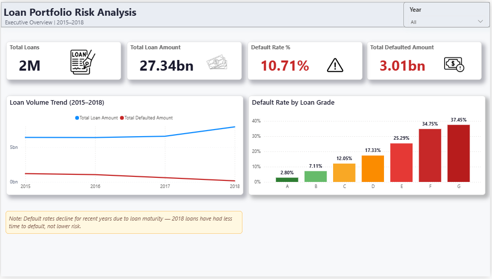
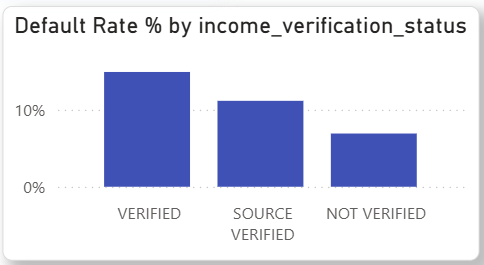
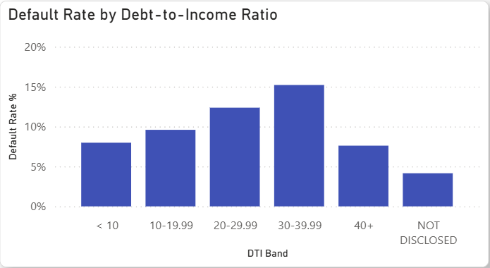
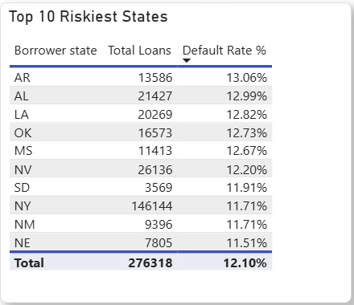

Credit Risk Intelligence Dashboard

SQL Server + Power BI analysis of 1.79M+ loans, uncovering risk patterns in credit verification, debt-to-income, and portfolio exposure.

The Business Question

Before approving any loan, a lending company needs to answer one question with real money on the line: which borrower profiles are most likely to default, and is the existing grading and verification process actually working the way it's assumed to?

The Approach

I worked with Lending Club's 2015–2018 loan dataset (~1.79M records, $27.3B in volume), staging the raw CSV as text first to avoid failed imports, then cleaning and standardizing it into a structured SQL Server table — fixing inconsistent formats, handling missing values, and capping extreme income outliers. From there I built a series of risk-segmented views analyzing default rate across FICO score, DTI, income, loan grade, purpose, state, and verification status, feeding into a four-page Power BI dashboard covering portfolio health, risk segmentation, portfolio composition, and geographic exposure.

Key Findings

Of the $27.3B portfolio, $3.01B ended up charged off — a 10.71% default rate overall.

Verified loans defaulted more than unverified ones — 14.91% vs 6.91%.

That looks backwards, since verification should reduce risk, not predict it. But the verified group itself turned out to have a riskier profile to begin with: higher average loan amounts, higher debt-to-income ratios, and lower average income than unverified applicants. That's likely why they got flagged for verification in the first place, not the other way around — verification isn't reducing risk, it's confirming risk that was already there. For a lender, that means "verified" shouldn't be treated as a positive signal in any risk model.

Default rate didn't rise cleanly with debt-to-income either.

The highest DTI band (40%+) actually defaulted less than the 30–39.99% band (7.60% vs 15.20%). I checked whether credit score explained the gap, but average FICO was nearly identical across both groups (703 vs 697) — not enough to account for it. It's a real, verified pattern, but the underlying cause isn't clear from this dataset alone and would need further investigation.

The fundamentals held up as expected, which matters as validation: default rate climbed steadily from Grade A to Grade G, and dropped consistently as FICO bands increased — confirming the core grading model has real predictive signal, even with the DTI and verification blind spots above.

Risk also isn't evenly distributed geographically.

Small business loans defaulted at 15.85%, nearly double auto loans (8.17%). And the five highest-default states — Arkansas, Alabama, Louisiana, Oklahoma, Mississippi — were all lower-volume states in the 12.6–13% range, while high-volume states like New York had a lower rate (~11.7%) but far greater total dollar exposure simply due to scale.

The Catch

When I looked at default rate by loan issue year, 2018 loans showed a noticeably lower default rate than 2015 loans — which could easily be misread as "credit quality improved over time." But that comparison is misleading: a 2015 loan has had years to potentially default, while a 2018 loan has barely had time to season. I flagged this as a maturity-bias caveat directly on the dashboard rather than letting the trend stand unqualified.

Tools Used

SQL Server (SSMS) · Power BI · DAX
